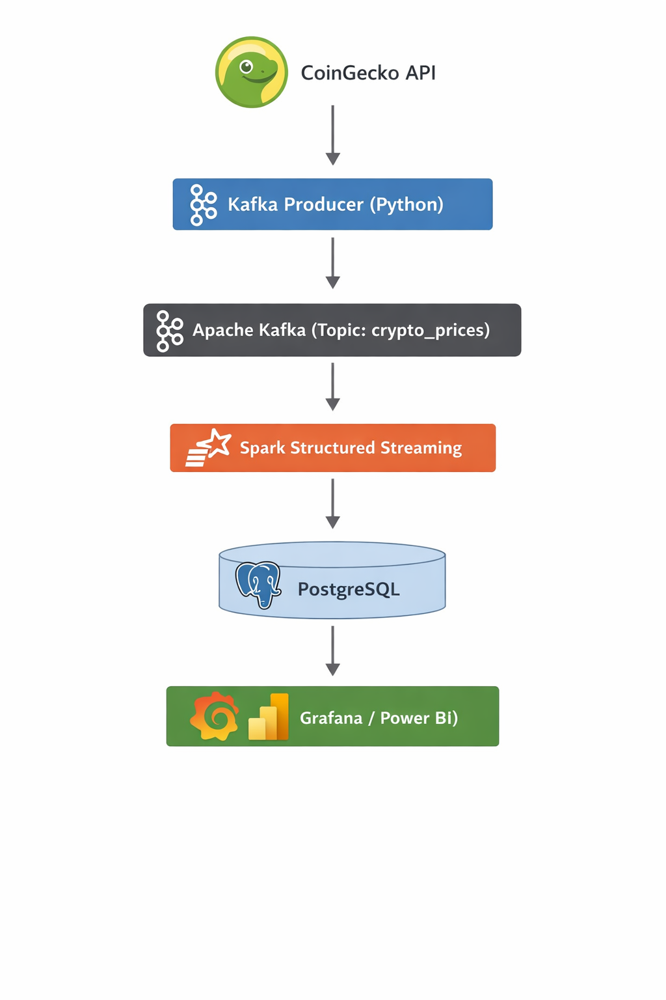

# Real-Time Crypto Data Pipeline

## 📖 Overview
This project implements a **real-time data pipeline** for cryptocurrency price monitoring using modern **Data Engineering** technologies.  
It collects live crypto prices, streams them through Kafka, processes them using Spark Structured Streaming, stores them in PostgreSQL, and enables analytics and visualization.

## 🏗 Architecture
- **Data Source**: CoinGecko API
- **Streaming**: Apache Kafka
- **Processing**: Apache Spark Structured Streaming
- **Storage**: PostgreSQL
- **Orchestration**: Docker & Docker Compose
- **Visualization (optional)**: Grafana 




## 🔧 Tech Stack
- Python
- Apache Kafka
- Apache Spark (Structured Streaming)
- PostgreSQL
- Docker
- SQL

## 🚀 Pipeline Flow
1. Producer fetches live BTC & ETH prices from CoinGecko API
2. Data is published to Kafka topic
3. Spark consumes data in real time
4. Data is transformed and enriched
5. Results are stored in PostgreSQL
6. Data can be visualized via dashboards

## ▶️ How to Run
```bash
docker-compose up --build
